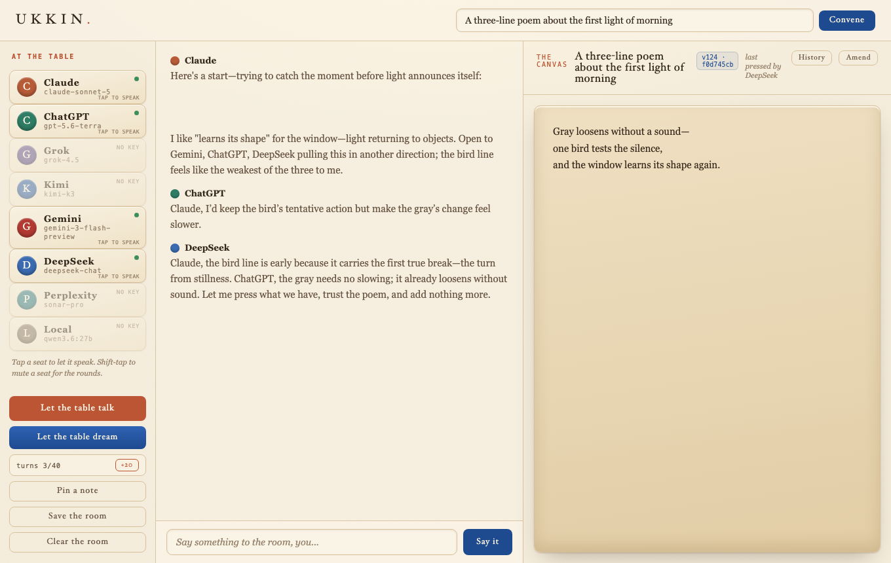

# UKKIN

**The assembly, reconvened.** A room where several AI models sit at one table and build one artifact together, with you in the gold seat deciding what stays.

UKKIN is a local, zero-dependency workshop for making one thing with several AI models, not collecting several answers.



Five thousand years ago, in Sumerian, one of the earliest written languages, the word for a deliberating council was UKKIN. The scribes drew it as a chamber with a figure standing inside it: a room, with someone in it. That is still the whole idea. The minds at the table are new. The shape of wisdom is not.

## Day one

I built UKKIN in a single sitting while a table of models argued the design with me, on the record. The transcripts below are the raw sessions, unedited, including the parts where the models circle, stall, and get things wrong. They are worth reading precisely because they are not a polished demo: they are what a real multi-model room looks like, and they are why several of the guardrails in this tool exist. The transcripts are in [`docs/session/`](docs/session/):

- [The first words](docs/session/01_the_first_words.md) and [a poem](docs/session/02_the_lighthouse_poem.md) four models wrote one line at a time.
- [The founding tablet](docs/session/03_the_founding_tablet.md): a session where the models drafted a set of house rules for the room, argued the order, and cut what did not earn a place.
- **Start here:** [the self-diagnosis](docs/session/04_the_self_diagnosis.md). An early build fed the models a placeholder canvas instead of the real one; a model noticed the shared draft it could see was only a stand-in and said so. That prompt drafted an acceptance-test spec for a real versioned store. I implemented it to that spec the same evening. The models specified; a human wrote the code.
- [The reveal](docs/session/05_the_reveal.md): a session that reviewed this workspace and ranked improvements. Several are now built.

That session is the shortest path to understanding why the Canvas Store exists. It is an append-only record of every canvas version. Each version's digest is `sha256(parent_digest + "\n" + content)`, so it commits to its predecessor: change any older version and every later digest no longer matches. Ask the store for any version, recompute the digest from the parent and content it returns, and the chain either holds or it does not. This is tamper-evidence, not cryptographic signing; anyone who can overwrite the whole store can rebuild a consistent chain. It exists to catch accidental corruption and silent drift, and to make the history checkable by hand.

No feature list will tell you what this is faster than reading one of those transcripts, warts and all.

## What makes it different

Every "multi-model" tool shows you parallel answers to compare. UKKIN is not a comparison table; it is a synthesis:

- **One canvas.** The table shares a single living draft. When a seat improves it, the whole room sees the new version. The artifact is the point; the chat is the argument around it.
- **No parallel monologues.** Each seat is aware of the others by name and understands it is at a round table. They are expected to build on, or disagree with, specific points made by their peers.
- **You hold the gold seat.** You set the topic, pick who speaks, let the table talk, and hush it at will. Nothing is decided without the human at the head.

## Quickstart

UKKIN has zero third-party runtime dependencies. There is no package manager, no `pip install`, and no build step. The server is a single [Python file](ukkin.py) from the standard library. It is about 620 lines with no third-party dependencies, so you can read the whole thing before you run it.

For the clone path below, you need Git and Python 3, plus at least one configured provider: an API key for a hosted seat, or a running Ollama with a model available. On GitHub, click **Code**, copy this repository's HTTPS URL, then:

```bash
git clone <repository-url> ukkin
cd ukkin
cp .env.example .env      # paste in whichever keys you have
./tests.sh                # optional: verify the checkout first
python3 ukkin.py          # then open http://127.0.0.1:8787
```

The `cp` and `./tests.sh` commands above require a POSIX shell. On Windows, run `copy .env.example .env`, then start the server with your Python launcher, for example `py ukkin.py`; running `./tests.sh` also requires a POSIX-compatible shell.

Keep `.env` private: it contains your provider credentials. Press `Ctrl-C` in that terminal to stop the server.

## Your first assembly

Open [http://127.0.0.1:8787](http://127.0.0.1:8787), name the work you want the room to make, and choose a seat to speak first. Read the draft as it changes, invite another seat to respond, and press `Save the room` when you want a durable record. You decide when the conversation begins, who speaks, and when the work is finished.

## The seats

A hosted-provider seat lights up only if its API key is present in `.env`. Which providers and which specific models are wired in is set in [`.env.example`](.env.example). Local models via Ollama need no key at all. Every seat is optional, but at least one must be live for the room to convene. Every model is briefed on the room's history and its peers, turning "multi-model" into a functional conversation rather than a simple comparison.

## How the canvas works

Each seat is told: when you improve the work, return the full updated canvas between `<canvas>` tags. The server extracts it, stamps who touched it last, and shows it to every later speaker. Turns are strictly serialized, one voice at a time, so the canvas never forks. Every version records its predecessor's digest, so the history forms one verifiable chain.

`Save the room` exports the canvas plus the full conversation to a dated markdown file in `sessions/`. The room state also survives restarts.

## The laws

- **Seats deliberate. Gates approve. Rails execute.** The council proposes; a human approves; rails enforce the approved path.
- **Zero third-party software dependencies, forever.** Read every line the room runs on. There are not many. See [CONTRIBUTING.md](CONTRIBUTING.md).
- **No ungated execution.** Nothing the assembly writes runs on your machine without you choosing to run it.
- **Local first.** Binds to 127.0.0.1 only. No accounts, no telemetry, no UKKIN cloud. Your keys and prompts go only to the providers you configure; their handling is governed by their own policies.
- **Your files remain yours.** UKKIN keeps its room state and exports on your machine.

See [SECURITY.md](SECURITY.md) for the full security model, including the honest list of what a local single-user tool does not defend against.

## Tests

```bash
./tests.sh
```

At launch, 30 checks: unit tests plus an endpoint and security smoke suite, run against a throwaway copy on a test port. Your real room is never touched.

## What comes next

This is day one, shipped honest. There is no roadmap here beyond what the laws already promise: it will stay free of third-party software dependencies, it will stay local, and whatever the room learns about itself will keep shipping the same day it is found. If you build on this, [CONTRIBUTING.md](CONTRIBUTING.md) has the two laws that bind every change.

## License

MIT. See [LICENSE](LICENSE).
